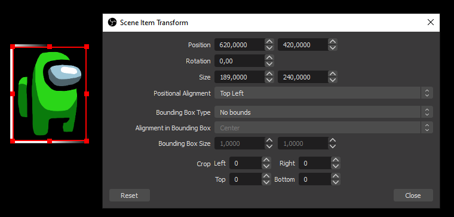

# Among Us animated camera border

The idea behind this project is to add a little interactivity to your cam border when playing your games of among us.

- If you or any of your mod write `!imp` then your cam border will become red.
- If you or any of your mod write `!crew` then your cam border will become blue.

To have something funnier, the border can be animated. Right now there are three options:

- **static** (the cam border does not moved at all, only solid color)
- **blink** (the cam border blink from transparent to solid color)
- **rotate** (the cam border rotate around you)

## Adding the border to your OBS Studio or StreamLabs OBS setup

To add this animated border to your setup, simply create a new browser source with the following url : `https://eskimon.fr/amongus-cam-border/`

**THEN**, you can add parameters to the URL to setup the border:

- `channel`: Your twitch channel! (to read the chat)
- `h`: height size (px) of your camera
- `w`: width size (px) of your camera
- `t`: position of your camera from the top (px)
- `l`: position of your camera from the left (px)
- `style`: style of the animation, can be: `static`, `blink`, `rotate` (default rotate)
- `speed`: speed of the animation (default 5s)
- `radius`: radius of the border (default 0px)

So for example if my camera is in the bottom left (600px from the top, 60px from the left) of my screen and is 400 by 300px I will use the following url:

`https://eskimon.fr/amongus-cam-border/?channel=eskimon&w=400&h=300&t=600&l=60&style=blink&speed=1`

## Finding my camera size

If you don't know how to find your facecam size, find its source element in your OBS. Then, right-click on it and select "Edit Transform...". In the popup you then can see the position and the size of the element!

## Command

To show the impostor color, send `!i`, `!imp` or `!impostor`.
To show the crewmate color, send `!c`, `!crew` or `!crewmate`.

Any of those command can be sent from you or any of your mods.

## Tip

If you don't want to alt-tab during a game, don't forget that this is all "chat driven", so you can simply send a message from a StreamDeck for example.
If you don't own one, I've developed a [web version called "DeckyDecky"](https://deckydecky.com) that is free to use! With it you can pilot your stream and simply make a button to send a "!imp" or a "!crew" from any tablette or smartphone that you have around!

